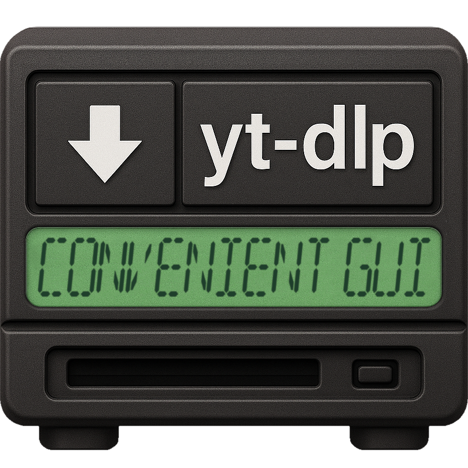

# yt-dlp Convenient GUI
<div align="center"></div>

A simple and intuitive graphical interface for yt-dlp that allows you to download videos and audio from YouTube and other platforms with ease.

## Quick Start

### Windows Users
Double-click `run.bat`

### macOS & Linux Users
Open a terminal, then:
```bash
# Go into the project main directory
cd /path/to/the/app/folder
# Run the script
./run.sh
```
If you have a permission issue you can try
```bash
# Make executable
chmod +x run.sh
```

The script automatically:
- Detects your OS and distribution
- Installs Python 3, pip, and FFmpeg using your system's package manager
- Installs all Python dependencies
- Launches the application

## Features

- Download videos in various qualities (144p to 4K)
- Extract audio in multiple bitrates (32Kbps to 320Kbps)
- Support for MP3 and MP4 formats
- Simple and clean interface
- Cross-platform compatibility

## Usage Tips

1. **Paste any video URL** in the input field
2. **Choose format**: MP3 for audio, MP4 for video
3. **Select quality/bitrate** as needed
4. **Click Download** and wait for completion

## Troubleshooting

### Windows
- If Python installation fails, restart your computer and run `run.bat` again
- For antivirus issues, add the project folder to exceptions

### macOS & Linux
- Make sure the script is executable: `chmod +x run.sh`
- For permission issues, the script will prompt for your password when needed
- If your distribution isn't supported, install manually:
  ```bash
  # Install Python 3, pip, and FFmpeg using your package manager
  pip3 install -r requirements.txt
  python3 run.py
  ```
