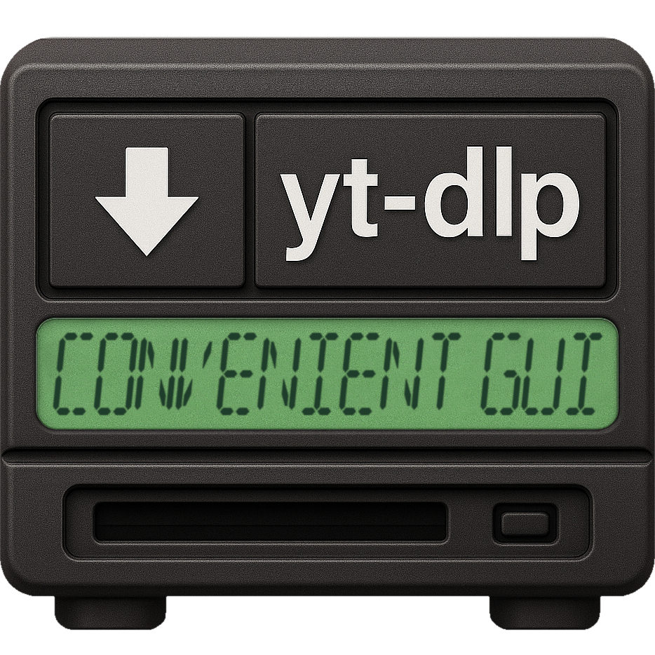

# yt-dlp Convenient GUI
<div align="center">
  
  <p>
    <a href="https://github.com/Nicolas-Gth/yt-dlp-convenient-GUI/blob/main/LICENSE"></a>
    
    
    <a href="https://github.com/Nicolas-Gth/yt-dlp-convenient-GUI/stargazers"></a>
    <a href="https://github.com/Nicolas-Gth/yt-dlp-convenient-GUI/pulse"></a>
  </p>
</div>

A simple and intuitive graphical interface for yt-dlp that allows you to download videos and audio from YouTube, YT Music and Soundcloud either individually or as a playlist with ease.

## Quick Start
First download and extract the [.zip archive](https://github.com/Nicolas-Gth/yt-dlp-convenient-GUI/archive/refs/heads/main.zip) or clone the project with `git clone https://github.com/Nicolas-Gth/yt-dlp-convenient-GUI.git`.
### Windows Users
Right-click `install.ps1` → **Run with PowerShell**

### macOS & Linux Users
Open a terminal, then:
```bash
# Go into the project main directory
cd /path/to/the/extracted/app/folder
# Run the installer
./install.sh
```
If you have a permission issue, you can do
```bash
# Make executable
chmod +x install.sh
```

The script automatically:
- Detects your OS and distribution
- Installs Python 3, pip, and FFmpeg using your system's package manager
- Installs all Python dependencies
- Prompts you to install Git if you don't have it already
- Updates the application automatically if Git is installed
- Creates a desktop shortcut so you can launch the app from your application menu
- Launches the application

## Features
- Download videos in various qualities (144p to 4K)
- Extract audio in multiple bitrates (32Kbps to 320Kbps)
- Support for MP3, Opus and MP4 formats
- Audio normalization for consistent playback volume
- Advanced metadata search: automatically fetches and embeds rich track info (artist, album, cover art, etc.)
- Synchronized lyrics search: embeds time-synced lyrics (LRC) directly into downloaded files
- Simple and clean interface
- Remembers settings
- Warns you if videos from your playlist are no longer accessible, private or age-restricted so you can search for an alternative or set a cookies file.
- Cross-platform compatibility

## Usage
1. Paste a video URL from YouTube, YT Music or Soundcloud in the input field
2. Choose format MP3 or Opus for audio, MP4 for video
3. Select the max quality/bitrate as needed
4. Select if you want to download an individual video or a playlist
5. Pick extra options like audio normalization or metadata fetching
6. Click the download button and wait for completion

## Troubleshooting
### Windows
- If Python installation fails, restart your computer and run `install.ps1` again
- For antivirus issues, add the project folder to exceptions

### macOS & Linux
- Make sure the script is executable: `chmod +x install.sh`
- For permission issues, the script will prompt for your password when needed
- If the launcher couldn't install the needed packages you might have to install them manually. This process will depend on your OS and you will have to install the following:
  - Python 3, pip, and FFmpeg using your package manager
  - ```pip3 install -r requirements.txt```

## License
This project is licensed under the [GNU GPL v3](LICENSE).
